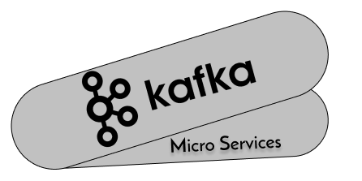

<h1 align="center">
      
</h1>

<h3 align="center">
  Kafka and Micro Services
</h3>

This is a simple aplication to test a messagem broker with multiples services 👨‍💻

Made with Python 🚀

Using Kafka, Docker, Unittest and Micro Services Architecture 🚀

  

  

  <a href="#-instalation-and-execution">Installation and execution</a>&nbsp;&nbsp;&nbsp;|&nbsp;&nbsp;&nbsp;
  <a href="#-available-routes">Available Routes</a>&nbsp;&nbsp;&nbsp;|&nbsp;&nbsp;&nbsp;
  <a href="#-how-to-contribute">How to contribute</a>&nbsp;&nbsp;&nbsp;|&nbsp;&nbsp;&nbsp;

## 🎉 Installation and execution

1. Clone this repository;
2. `cd micro_services_kafka` ;
3. Run `docker-compose up` to install dependencies and activate the server;
4. Run each python file to test the consumer and producer

## 🛣️ Available Consumers and Producers

- 'service_new_order' - Producer .
- 'service_log_service' - Consumer .
- 'service_fraude_detector' - Consumer .
- 'service_email_service' - Consumer .

## 🤔 How to contribute

- Fork this repository;
- Create a branch with your feature: `git checkout -b my-feature`;
- Commit your changes: `git commit -m 'feat: My new feature'`;
- Push to your branch: `git push origin my-feature`.

After the merge of your pull request is done, you can delete your branch.

---

